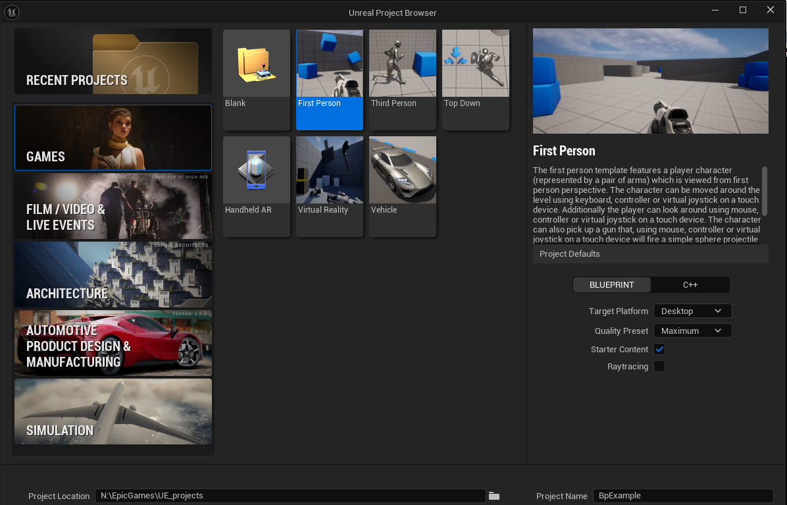
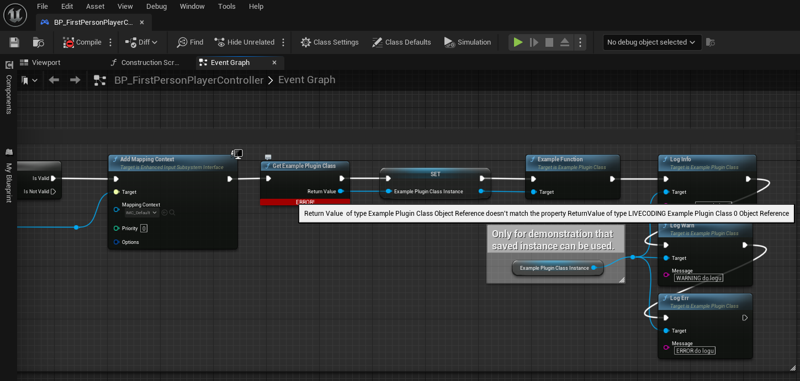

# Originálně vytvořený pouze BP projekt s přidáním C++ zdrojáků dodatečně


## Jak to celé rozchodit a nezbláznit se z toho

TODO: Sepsat presne postup jak jsem to cele rozchodil (a vzteky to u toho nerozslapal)

## Tyhle věci se věčně hnojí sami od sebe!

❌ Předchozí den vše v poho, další den jen otevřeš projekt, klikneš na Live Coding a hle:

```
Failed to move file from N:\EpicGames\UE_projects\BPExample\Intermediate\Build\Win64\x64\UnrealEditor\Development\BPExample\BPExample.cpp.obj to 
N:\EpicGames\UE_projects\BPExample\Intermediate\Build\Win64\x64\UnrealEditor\Development\BPExample\BPExample.cpp.obj.lctmp. Error: 0x5
```
Jako jaký má smysl přesouvat nějaký soubor (ne jen tento je jich mnoho) v rámci stejné složky, takže přejmenovávat z BPExample.cpp.obj na BPExample.cpp.obj.1ctmp?
OK takže zase trapné kolečko, zavřít VS zavřít UE, vymazat složku *Plugins\ExampleBlankPlugin\Intermediate*, otevřít znovu UE a spusti znovu kompilaci přes Live Coding...
BUM💥 ani to nedoběhlo a UE 5.4.1 padá na hubu tvrdou chybou!
```
Unhandled Exception: EXCEPTION_ACCESS_VIOLATION 0x0000000300905a4d

UnrealEditor_BPExample_patch_1!__ImageBase <PERF> (UnrealEditor_BPExample_patch_1+0x1044)()
ucrtbase
UnrealEditor_BPExample_patch_1!dllmain_crt_process_attach() [D:\a\_work\1\s\src\vctools\crt\vcstartup\src\startup\dll_dllmain.cpp:66]
UnrealEditor_BPExample_patch_1!dllmain_dispatch() [D:\a\_work\1\s\src\vctools\crt\vcstartup\src\startup\dll_dllmain.cpp:276]
UnrealEditor_LiveCoding
UnrealEditor_LiveCoding
UnrealEditor_LiveCoding
ucrtbase
kernel32
```
Vůbec nechápu co je to tam za cestu, disk D: sice mám, ale na něm žádná složka D:\a neexistuje, takže co to plácá?
Každopádně jediné řešení na které jsem přišel je uvedeno na konci této sekce.

❌ Stačí něco změnit v C++ (naprosto validní nebo bezvýznamná změna, která nic nerozbíjí) a najednou se v BP divíš co to provádí:

```Can't connect pins  Target  and  Return Value : Example Plugin Class Object Reference is not compatible with LIVECODING Example Plugin Class 0 Object Reference.```


> [!IMPORTANT]
> No jediný způsob jak tyto prapodivné problémy opravit je celé to zavřít (UE i VS) a smazat jak v projektu **BPExample** tak ve vnořeném projektu 
> **Plugins\ExampleBlankPlugin** složky **Intermediate** Potom znovu otevřít projekt a nechat ho celý i s pluginen znovu sestavit.
> To je prostě taková 💩
> Pokud by to postoupilo na vyšší level a ani tohle nepomohlo, potom jedině asi ještě smazat složky **.vs** a **Binaries**

----
## Pokročilejší možnosti
- [Nastaveni log level-u](Log_level.MD)

- [Vytváření BP nodů s možností přidat/odebrat piny nebo některé parametry skrýt](BP_with_add_pins_or_hide_parameters_in_CPP.MD)

- [Singleton s instancí uloženou ve statické proměnné](CPP_Singleton_statically_stored.MD)

